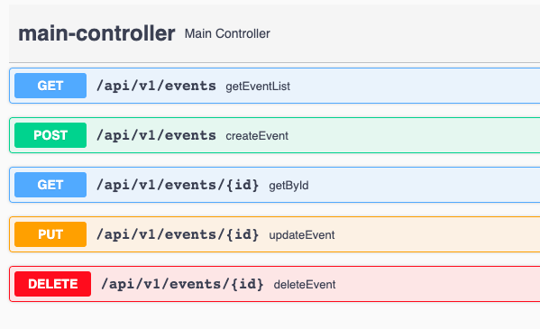

## Get Started with App

### Build Commands
* mvn package install

### Run Application

* java -jar event-service-rest/target/event-service-rest-0.1.0.jar

### DB Console

* http://localhost:8080/h2-console

### Swagger

* http://localhost:8080/swagger-ui/

